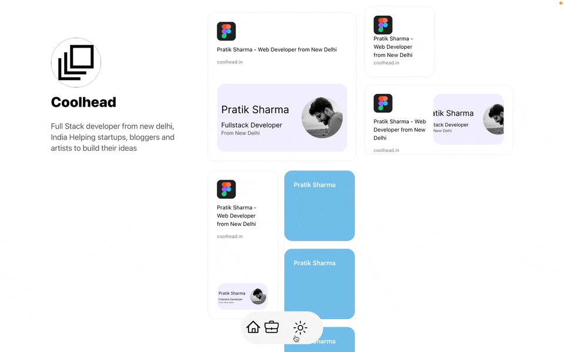

### HMU: Hit me up
HMU is a porfolio template for bloggers, indie developer, any 1 who is on internet and wants to write and sell its goods. The aim is to be composable, adaptable and plug&play. It's a Static Site Generator.  




#### Tech Stack
- Tailwind
- Nextjs
- [Resend](https://resend.com/)
- [Lemon Squeezy](https://www.lemonsqueezy.com/)
- [Headless hashnode](https://github.com/hashnode/starter-kit)
- [Open AI Wisper](https://github.com/openai/whisper)
- [ChatGPT](https://chat.openai.com/)
- [Dnd Kit](https://dndkit.com/)
- [Nextjs Themes](https://www.npmjs.com/package/next-themes)
- [React-query](https://tanstack.com/query/latest/docs/react/overview)
- [Kbar](https://kbar.vercel.app/)
- [Tailwind Animation](https://www.npmjs.com/package/tailwindcss-animate#changing-animation-delay)
- [Lucide React icons](https://lucide.dev/guide/packages/lucide-react)

#### Features
- SEO
- Blogs
- Launch Site
- Marketplace
- AI intergrations for writing
- Local First

---

### Bento Layout

Bento Card Types: Big, Long, medium, small, 
small => 180px, 180px => 360px
gap=> 
long => 80px, 380px;

text sizes;
large = 20px; line-height: 26px, 400
header = 14px; line-height: 16.8px, 400
description = 12px; rgba(0,0,0,0.6), line-height: 16px
buttontext = 12px; 700, white


## Getting Started

First, run the development server:

```bash
npm run dev
# or
yarn dev
# or
pnpm dev
# or
bun dev
```


### References 
https://dev.to/newbing/how-to-use-lemon-squeezy-as-a-payment-in-nextjs-e46
Infinite scroll: https://www.youtube.com/watch?v=FKZAXFjxlJI